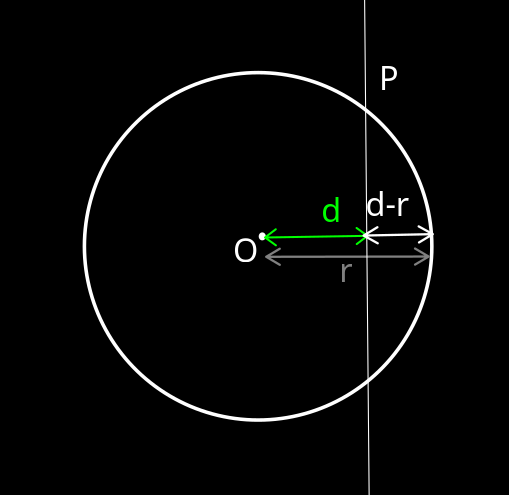
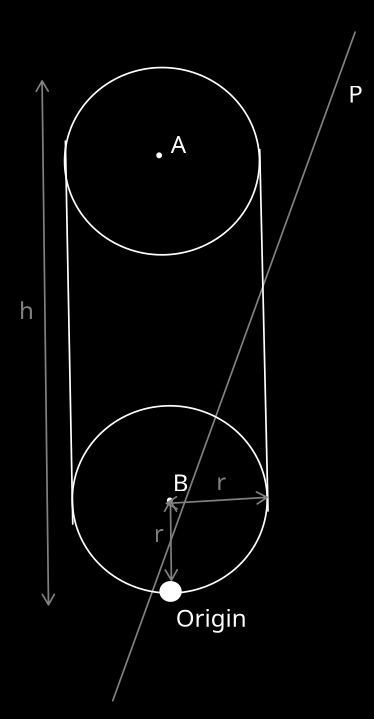

## Formulas used
* **Transformations** (for controls and collision resolution):
$$ R * T * X * (R * T)^{-1},$$
$$ R, T - motors, $$
$$X \in n-vector, n \in [1, 3]$$
* **Distance acquisition** (for collision detection):
$$ d_1 = |A_n \lor B_m|,$$
$$ n,m \in [1,3] $$
* **Angle determination**(for player character and enemy rotation):
$$cos(\alpha) = a \cdot b / (|a|+|b|),$$
$$|sin(\alpha)| = |a\wedge b / (|a|+|b|)|,$$
$$\alpha = atan2(sin(\alpha),\;cos(\alpha)),$$
$$ n,m -bivectors,\;\alpha - \measuredangle(n,m) $$
* **Direction plane$^*$ between 2 points**(for sphere-sphere collision)
$$p = (P(A) \wedge P(B))\lor e_{123}$$
\* Direction plane is such p., normal of which is collinear with $A \lor B$.
**NOTE:** Not using join in the left operand, because its formula involves application of inverse dual, which is unneded in this case.
***
## Specific applications
## Camera and character
The project involves 3rd person camera, which gives an ability rotate around the character when motionless.
When moving, the character rotates to face the same direction as the camera does.
# Collisions
Camera uses sphere collisions, and character - capsule collisions to realistically interact with the environment. 
## Sphere-plane collisions(for camera)
$Given$:
$$ \hat{O}^{(3)} = O - sphere's\;center(normalized), $$
$$ r^{(0)} = r - sphere's \;radius, $$
$$ \hat{P}^{(1)} = P\;- collision\;plane(normalized)$$
$Find$:
$$ O^{(3)}_1 = O_1 - sphere's\;center\;after\;collision $$
$Solution$:
$1)\;Getting\;distance\;from\;sphere's\;origin\;to\;the\;plane$
$$d = |O \lor P| = H^{-1}(H(O) \wedge H(P))$$

$2)\;d < r => Sphere(O, r)\;\cap\;P$:

$2.1)\;Retrieving\;the\;translation\;motor$:

$$T = 1 - \frac{1}{2} t (-e_0),$$
$$t = (d-r) \hat{P}^{(1)}$$
$\textbf{NOTE}: The\;e_0\;coefficient\;of\;P\;is\;irrelevant,\;because\;it\;turns\;into\;void\;regardless.$

$\textbf{NOTE}: See\;rationale\;behind\;translation\;by\;(d-r)\;in\;the\;Figure\;1.$

    

$$ Figure\;1.\;Sphere-plane\;collision\;resolution$$

$2.2)\;Translating\;the\;sphere's\;origin$:
$$O_1^{(3)}=<T\;O\;T>_3\;(gep) - solution$$

#### Capsule-plane collisions(for character)
$Given$:
$$h^{0} - capsule's\;height$$
$$r^{0} - capsule's\;radius$$
$$\hat{O}^{3} = O = O_{x}\;e_{021}+O_y\;e_{013}+O_z\;e_{032}+O_w\;e_{123} - capsule's\;origin$$ 
$Find$:
$$ O^{(3)}_1 = O_1 - capsules\;center\;after\;collision $$
$Solution$:
$1)\;Finding\;A^3\;and\;B^3.\;See\;Figure\;2\;for\;reference$
$A^3 = A = O_x\;e_{032}+\textbf{(h-r)}\; O_y\;e_{012}+O_z\;e_{013}+O_w\;e_{123}$
$B^3 = B = O_x\;e_{032}+\textbf{r}\;O_y\;e_{012}+O_z\;e_{013}+O_w\;e_{123}$

	

$$ Figure\;2.\;Capsule-plane\;collision$$
$2)\;Retrieving\;the\;closest\;sphere$
$$d_A = |A \lor P|,\; d_B = |B \lor P|$$
$$|d_A| < |d_B| => A\;is\;closer\;and\;vice\;versa$$
$3)\;Performing\;collision\;handling\;on\;the\;closest\;sphere.$
$See$ [[#Sphere-plane collisions(for camera)]].
$\textbf{NOTE}:Instead\;of\;applying\;translation\;to\;sphere's\;origin,\; it\;should\;get\;applied\;to\;the\;capsule's\;origin.$

#### Sphere-sphere collisions(between enemies and character)
**NOTE:** Since there's no vertical movement present, it is sufficient to always test against only bottom spheres.
$Given$:
$$ \hat{E}^{(3)} = E - enemy's\;origin(normalized), $$
$$ \hat{C}^{(3)} = C - character's\;origin(normalized), $$
$$r_E, r_C - radii$$
$Find$:
$$C' - character's\;origin\;after\;collision$$
$$E' - enemy's\;origin\;after\;collision$$
**NOTE:**  Both actors are moved by the same distance for simplicity.
$Solution$:
$1)\;Finding\;distance\;and\;proceed\;if\;it's\;larger\;than\;sum\;of\;radii$
$$dist=|E\lor C|,$$
$$dist > r_E + r_C =>proceed$$
$2)\;Determining\;translation\;vectors$
$$dir_B = normalize(P(E) \wedge P(C) \lor e_{123}),$$
$$translationDist = dist - (r_E + r_C),$$
$$translation_B = dir_B\;translationDist$$
$$translation_A=-translation_B,$$
$3)\;Calculating\;translation\;motors$
$$T_A = 1 - \frac{1}{2} translation_A (-e_0),$$
$$T_B = 1 - \frac{1}{2} translation_B (-e_0) - solution$$

## Enemy rotation
Logic for rotating enemies towards the player.
$Given\;$:
$$ \hat{E}^{(3)} = E - enemy's\;origin(normalized), $$
$$ \hat{C}^{(3)} = C - character's\;origin(normalized), $$
$\textbf{NOTE}: The\;e_{012}(vertical)\;component\;is\;irrelevant,\;because\;only\;yaw\;is\;affected.$
$$ \hat{V}^{(2)} = V - enemy's\;initial\;view\;direction(normalized),$$
$Find\;$:
$$R-rotation\;motor\;to\;apply\;to\;B\;to\;direct\;it\;towards\;C$$
$Solution\;$:
$1)\;Calculating\;final\;enemy's\;view\;direction$
$$V'=C\;\lor\;E\;/\;(|C|\cdot|E|) - enemy's\;final\;view\;direction(normalized)$$
$2)\;Calculating\;cos(\alpha)$
$$cos(\alpha) = V \cdot V'$$
**NOTE:** No division by norms since the bivectors are normalized.
$3)\;Calculating\;the\;sign\;of\;sin(\alpha)$
$$\hat{w}^{2} = w = V\wedge V'/ (|a|\cdot|b|) =$$
$$w_1 e_{23} + w_2 e_{31} + w_3 e_{12},$$
$$s = w_1\cdot w_2\cdot w_3 / |w_1\cdot w_2\cdot w_3|  - sign,$$
$$s\in\{-1,1\}$$
**NOTE:**  If $w_n =0, n \in R$, then it must be removed from equation(or set equal to 1).

$3.1)\;Calculating\;sin(\alpha)$
$$sin(\alpha) = s \cdot |w|$$

$4)\;Calculating\;the\;angle$
$$\alpha = atan2(sin(\alpha),\;cos(\alpha)) - solution$$

